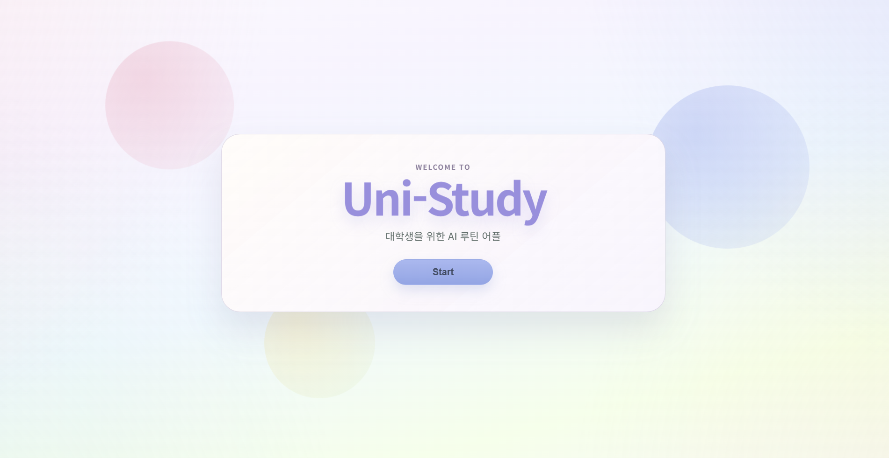
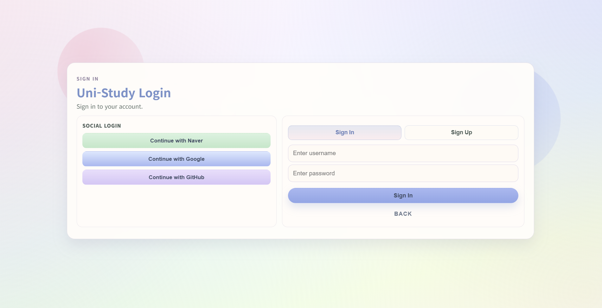
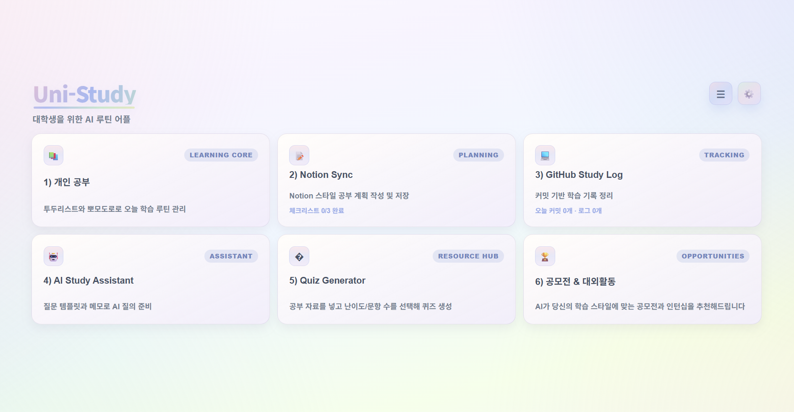
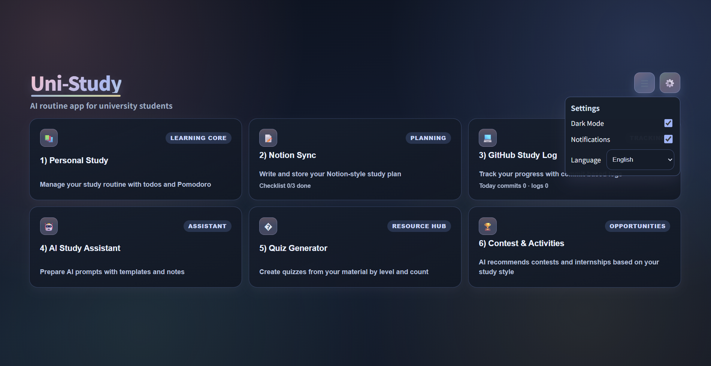

# Uni-Study

### 대학생을 위한 AI 루틴 대시보드

2026 Microsoft 입코딩 대회 출품작

---

## 🔗 실행 링크

- Azure 배포 앱 (심사용 권장): https://unistudyapi17227.azurewebsites.net/
- GitHub Pages: https://seeun-jang.github.io/uni-study/
- API Health: https://unistudyapi17227.azurewebsites.net/api/health

---

## 📌 프로젝트 소개

Uni-Study는 대학생의 학습 루틴을 한 화면에서 관리할 수 있도록 만든 웹 앱입니다.

학습 계획, 집중 시간, 학습 로그, AI 질문 메모가 여러 서비스에 흩어질 때 생기는 불편을 줄이고,
공부 흐름을 한 번에 볼 수 있는 통합 대시보드 경험을 목표로 했습니다.

핵심 방향:

- 개인 학습 루틴 관리
- 집중 시간 가시화
- 학습 기록 정리
- AI 기반 학습 보조

---

## 🖼️ 화면 미리보기

<table>
	<tr>
		<td align="center" width="50%">
			<a href="public/screenshots/logo.png">
				
			</a>
			<div><strong>인트로 화면</strong></div>
		</td>
		<td align="center" width="50%">
			<a href="public/screenshots/login.png">
				
			</a>
			<div><strong>로그인 화면</strong></div>
		</td>
	</tr>
	<tr>
		<td align="center" width="50%">
			<a href="public/screenshots/main.png">
				
			</a>
			<div><strong>메인 대시보드</strong></div>
		</td>
		<td align="center" width="50%">
			<a href="public/screenshots/settings.png">
				
			</a>
			<div><strong>설정 패널</strong></div>
		</td>
	</tr>
</table>

---

## 🎯 대상 사용자

- 과제, 시험, 자격증 공부를 동시에 관리해야 하는 대학생
- 개발 학습과 커밋 기록을 함께 정리하고 싶은 사용자
- 계획, 집중, 회고를 한 화면에서 보고 싶은 사용자
- AI에게 물어볼 내용을 정리하며 학습하고 싶은 사용자

---

## 🧩 주요 기능

### 1) 개인 학습 관리

- 할 일 추가, 완료, 삭제
- 로컬 상태 저장
- 로그인 사용자 데이터 동기화

### 2) 뽀모도로 타이머

- 25분 집중, 5분 휴식
- 시작, 일시정지, 초기화
- 완료 횟수 및 총 집중 시간 기록

### 3) 학습 기록 섹션

- 커밋 로그 형태의 학습 기록 관리
- 기록 추가/삭제
- 학습 흐름 시각화용 요약 정보 제공

### 4) AI Study Assistant

- 질문 템플릿 기반 빠른 입력
- 질문 메모 작성
- 역할 기반 Copilot API 연동 구조

### 5) 인증 및 보안

- 회원가입/로그인
- JWT Access/Refresh 토큰
- Rate limit, 입력 검증, 보안 헤더
- 계정 잠금 및 감사 로그

### 6) 확장 준비 기능

- Notion 연동을 고려한 구조
- 대외활동/공모전 추천 섹션 기반 UI

---

## 🛠️ 기술 스택

- Frontend: React, Vite, JavaScript, CSS
- Backend: Node.js, Express
- Auth/Security: JWT, bcrypt, helmet, express-rate-limit, zod
- Deployment:
	- Azure App Service (웹 + API)
	- GitHub Pages (프론트 미러)

---

## 📁 프로젝트 구조

```txt
uni-study/
├─ .github/
├─ public/
├─ server/
│  ├─ index.js
│  ├─ users.json
│  ├─ study-data.json
│  └─ audit.log
├─ src/
│  ├─ assets/
│  ├─ App.jsx
│  ├─ App.css
│  ├─ firebaseAuth.js
│  ├─ index.css
│  └─ main.jsx
├─ .env.example
├─ package.json
├─ vite.config.js
└─ README.md
```

---

## 🚀 로컬 실행

```bash
npm install
npm run dev:all
```

기본 접속:

- Frontend: http://localhost:5173/
- Backend: http://localhost:4000/api/health

---

## 📦 빌드

```bash
npm run build
```

---

## 🌐 배포 방식

- Azure App Service에서 루트 URL로 웹앱 화면 제공
- 동일 도메인에서 API 엔드포인트 제공
- GitHub Actions로 Pages 자동 배포

예시 엔드포인트:

- /api/health
- /api/ready

---

## 🔐 데이터 및 개인정보 안내

- 비로그인 상태에서는 브라우저 저장소를 중심으로 동작합니다.
- 로그인 상태에서는 학습 데이터가 서버 동기화 API를 통해 저장될 수 있습니다.
- 민감 정보 파일(.env)은 Git에 포함하지 않습니다.
- AI 응답은 학습 보조 목적이며 최종 판단은 사용자에게 있습니다.

---

## 🔮 향후 개선 방향

- Notion API 실제 연동
- GitHub API 기반 자동 로그 수집
- AI 추천/분석 고도화
- 사용자별 데이터 저장소(DB) 확장
- 개인화 추천 정확도 개선
